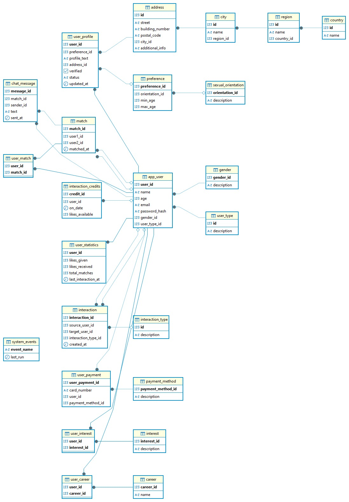

# Campus Love 💕

¡Bienvenido a Campus Love! Una aplicación de citas diseñada específicamente para el entorno universitario, donde podrás encontrar tu próximo amor mientras estudias.

## 📋 Tabla de Contenidos
- [Requisitos](#requisitos)
- [Instalación](#instalación)
- [Configuración de la Base de Datos](#configuración-de-la-base-de-datos)
- [Estructura del Proyecto](#estructura-del-proyecto)
- [Diagrama ER](#diagrama-er)
- [Scripts SQL](#scripts-sql)
- [Tecnologías Utilizadas](#tecnologías-utilizadas)
- [Contacto](#contacto)

## 🚀 Requisitos
- .NET 8.0 SDK
- PostgreSQL 12 o superior
- Visual Studio 2022 o Visual Studio Code

## 💻 Instalación

1. Clona el repositorio:
```bash
git clone https://github.com/tu-usuario/campus-love.git
cd campus-love
```

2. Restaura las dependencias:
```bash
dotnet restore
```

3. Compila el proyecto:
```bash
dotnet build
```

## 🗄️ Configuración de la Base de Datos

### Opción 1: Usar la contraseña del proyecto
Si deseas usar la contraseña predeterminada del proyecto (1219), ejecuta el siguiente comando en PostgreSQL:

```sql
ALTER USER postgres WITH PASSWORD '1219';
```

### Opción 2: Cambiar la contraseña en el proyecto
Si prefieres usar tu propia contraseña, modifica la cadena de conexión en los siguientes archivos:
- `Application/UI/MainMenu.cs`
- `Application/UI/CountryMenu.cs`
- `Application/UI/RegionMenu.cs`
- `Application/UI/CityMenu.cs`
- `Application/UI/CareerMenu.cs`
- `Application/UI/InterestMenu.cs`
- `Application/UI/UserTypeMenu.cs`
- `Application/UI/SexualOrientationMenu.cs`
- `Application/UI/UserCareerMenu.cs`
- `Application/UI/UserInterestMenu.cs`

Busca la línea que contiene:
```csharp
string connStr = "Host=localhost;Database=campus_love;Port=5432;Username=postgres;Password=1219;Pooling=true";
```

Y reemplaza `Password=1219` con tu contraseña.

## 📁 Estructura del Proyecto
```
CampusLove/
├── Application/         # Capa de aplicación
│   ├── Service/        # Servicios de negocio
│   └── UI/            # Interfaces de usuario
├── Domain/             # Capa de dominio
│   ├── Entities/      # Entidades del dominio
│   ├── DTO/           # Objetos de transferencia de datos
│   └── Ports/         # Puertos (interfaces)
└── Infrastructure/     # Capa de infraestructura
    └── Repositories/  # Implementaciones de repositorios
```

## 📁 Estructura del Repositorio

- `Diagrama Entidad - Relacion` - Muestra la relacion entre las entidades de la base de datos.
- `DDL.sql` - Contiene las sentencias para la creación de la base de datos y todas sus tablas.
- `DML.sql` - Contiene la inserción de datos de ejemplo para poblar la base de datos.
- `Procedimientos.sql` - Contiene los procedimientos almacenados utilizados por la aplicación.

## 📊 Diagrama ER


## 📜 Scripts SQL

### DDL - Definición de la Base de Datos
```sql
-- Crear base de datos
DROP DATABASE IF EXISTS campus_love;
CREATE DATABASE campus_love
WITH ENCODING 'UTF8'
TEMPLATE=template0;

\c campus_love;

-- 1. Geography

CREATE TABLE country (
  id SERIAL,
  name VARCHAR(100) NOT NULL,
  CONSTRAINT pk_country PRIMARY KEY (id)
);

CREATE TABLE region (
  id SERIAL,
  name VARCHAR(100) NOT NULL,
  country_id INTEGER NOT NULL,
  CONSTRAINT pk_region PRIMARY KEY (id),
  CONSTRAINT fk_region_country FOREIGN KEY (country_id)
    REFERENCES country(id)
);

CREATE TABLE city (
  id SERIAL,
  name VARCHAR(100) NOT NULL,
  region_id INTEGER NOT NULL,
  CONSTRAINT pk_city PRIMARY KEY (id),
  CONSTRAINT fk_city_region FOREIGN KEY (region_id)
    REFERENCES region(id)
);

CREATE TABLE address (
  id SERIAL,
  street VARCHAR(255) NOT NULL,
  building_number VARCHAR(20) NOT NULL,
  postal_code VARCHAR(20),
  city_id INTEGER NOT NULL,
  additional_info TEXT,
  CONSTRAINT pk_address PRIMARY KEY (id),
  CONSTRAINT fk_address_city FOREIGN KEY (city_id)
    REFERENCES city(id)
);

-- 2. Domain Catalogs

CREATE TABLE gender (
  gender_id SERIAL,
  description VARCHAR(50) UNIQUE NOT NULL,
  CONSTRAINT pk_gender PRIMARY KEY (gender_id)
);

CREATE TABLE sexual_orientation (
  orientation_id SERIAL,
  description VARCHAR(50) UNIQUE NOT NULL,
  CONSTRAINT pk_sexual_orientation PRIMARY KEY (orientation_id)
);

CREATE TABLE career (
  career_id SERIAL,
  name VARCHAR(100) UNIQUE NOT NULL,
  CONSTRAINT pk_career PRIMARY KEY (career_id)
);

CREATE TABLE interest (
  interest_id SERIAL,
  description VARCHAR(100) UNIQUE NOT NULL,
  CONSTRAINT pk_interest PRIMARY KEY (interest_id)
);

CREATE TABLE interaction_type (
  id SERIAL,
  description VARCHAR(30) UNIQUE NOT NULL,
  CONSTRAINT pk_interaction_type PRIMARY KEY (id)
);

CREATE TABLE user_type (
  id SERIAL,
  description VARCHAR(30)UNIQUE NOT NULL,
  CONSTRAINT pk_user_type PRIMARY KEY (id)
);

-- 3. Users and Authentication

CREATE TABLE app_user (
  user_id SERIAL,
  name VARCHAR(100) NOT NULL,
  age INT CHECK (age >= 18),
  email VARCHAR(100) UNIQUE NOT NULL,
  password_hash TEXT NOT NULL,
  gender_id INT NOT NULL,
  user_type_id INT NOT NULL,
  CONSTRAINT pk_app_user PRIMARY KEY (user_id),
  CONSTRAINT fk_app_user_gender FOREIGN KEY (gender_id)
    REFERENCES gender(gender_id),
  CONSTRAINT fk_app_user_type FOREIGN KEY (user_type_id) REFERENCES user_type(id)
);

-- 4. Preferences (including sexual orientation)

CREATE TABLE preference (
  preference_id SERIAL,
  orientation_id INT,
  min_age INT NOT NULL CHECK (min_age >= 18),
  max_age INT NOT NULL,
  CONSTRAINT pk_preference PRIMARY KEY (preference_id),
  CONSTRAINT fk_preference_orientation FOREIGN KEY (orientation_id)
    REFERENCES sexual_orientation(orientation_id)
);

-- 5. Public User Profile

CREATE TABLE user_profile (
  user_id INT,
  preference_id INT,
  profile_text TEXT,
  address_id INT NOT NULL,
  verified BOOLEAN DEFAULT FALSE,
  status VARCHAR(20) DEFAULT 'active',
  updated_at TIMESTAMP DEFAULT CURRENT_TIMESTAMP,
  CONSTRAINT pk_user_profile PRIMARY KEY (user_id),
  CONSTRAINT fk_user_profile_user FOREIGN KEY (user_id)
    REFERENCES app_user(user_id),
  CONSTRAINT fk_user_profile_preference FOREIGN KEY (preference_id)
    REFERENCES preference(preference_id),
  CONSTRAINT fk_user_profile_address FOREIGN KEY (address_id)
    REFERENCES address(id)
);

-- 6. Many-to‑Many Relationships

CREATE TABLE user_career (
  user_id INT,
  career_id INT,
  CONSTRAINT pk_user_career PRIMARY KEY (user_id, career_id),
  CONSTRAINT fk_user_career_user FOREIGN KEY (user_id)
    REFERENCES app_user(user_id),
  CONSTRAINT fk_user_career_career FOREIGN KEY (career_id)
    REFERENCES career(career_id)
);

CREATE TABLE user_interest (
  user_id INT,
  interest_id INT,
  CONSTRAINT pk_user_interest PRIMARY KEY (user_id, interest_id),
  CONSTRAINT fk_user_interest_user FOREIGN KEY (user_id)
    REFERENCES app_user(user_id),
  CONSTRAINT fk_user_interest_interest FOREIGN KEY (interest_id)
    REFERENCES interest(interest_id)
);

-- 7. Interactions (Like / Dislike)

CREATE TABLE interaction (
  interaction_id SERIAL,
  source_user_id INT,
  target_user_id INT,
  interaction_type_id INT,
  created_at TIMESTAMP DEFAULT CURRENT_TIMESTAMP,
  CONSTRAINT pk_interaction PRIMARY KEY (interaction_id),
  CONSTRAINT fk_interaction_source FOREIGN KEY (source_user_id)
    REFERENCES app_user(user_id),
  CONSTRAINT fk_interaction_target FOREIGN KEY (target_user_id)
    REFERENCES app_user(user_id),
  CONSTRAINT fk_interaction_type FOREIGN KEY (interaction_type_id)
    REFERENCES interaction_type(id)
);

-- 8. Matches and M:N Relationship

CREATE TABLE match (
  match_id SERIAL,
  user1_id INT,
  user2_id INT,
  matched_at TIMESTAMP DEFAULT CURRENT_TIMESTAMP,
  CONSTRAINT pk_match PRIMARY KEY (match_id),
  CONSTRAINT fk_match_user1 FOREIGN KEY (user1_id)
    REFERENCES app_user(user_id),
  CONSTRAINT fk_match_user2 FOREIGN KEY (user2_id)
    REFERENCES app_user(user_id)
);

CREATE TABLE user_match (
  user_id INT,
  match_id INT,
  CONSTRAINT pk_user_match PRIMARY KEY (user_id, match_id),
  CONSTRAINT fk_user_match_user FOREIGN KEY (user_id)
    REFERENCES app_user(user_id),
  CONSTRAINT fk_user_match_match FOREIGN KEY (match_id)
    REFERENCES match(match_id)
);

-- 9. Daily Interaction Credits

CREATE TABLE interaction_credits (
  credit_id SERIAL,
  user_id INT,
  on_date DATE NOT NULL,
  likes_available INT DEFAULT 5,
  CONSTRAINT pk_interaction_credits PRIMARY KEY (credit_id),
  CONSTRAINT fk_interaction_credits_user FOREIGN KEY (user_id)
    REFERENCES app_user(user_id),
  CONSTRAINT uq_interaction_credits_user_date UNIQUE (user_id, on_date)
);

-- 10. User Statistics

CREATE TABLE user_statistics (
  user_id INT,
  likes_given INT DEFAULT 0,
  likes_received INT DEFAULT 0,
  total_matches INT DEFAULT 0,
  last_interaction_at TIMESTAMP,
  CONSTRAINT pk_user_statistics PRIMARY KEY (user_id),
  CONSTRAINT fk_user_statistics_user FOREIGN KEY (user_id)
    REFERENCES app_user(user_id)
);

CREATE TABLE payment_method (
  payment_method_id SERIAL,
  description VARCHAR(50) NOT NULL UNIQUE,
  CONSTRAINT pk_payment_method PRIMARY KEY (payment_method_id)
);

CREATE TABLE user_payment (
  user_payment_id SERIAL,
  card_number VARCHAR(20) NOT NULL,
  user_id INT NOT NULL,
  payment_method_id INT NOT NULL,
  CONSTRAINT pk_user_payment PRIMARY KEY (user_payment_id),
  CONSTRAINT fk_user_payment_user FOREIGN KEY (user_id)
    REFERENCES app_user(user_id),
  CONSTRAINT fk_user_payment_method FOREIGN KEY (payment_method_id)
    REFERENCES payment_method(payment_method_id)
);

CREATE TABLE system_events (
  event_name TEXT PRIMARY KEY,
  last_run   DATE NOT NULL
);

CREATE TABLE chat_message (
  message_id   SERIAL   PRIMARY KEY,
  match_id     INT      NOT NULL REFERENCES "match"(match_id),
  sender_id    INT      NOT NULL REFERENCES app_user(user_id),
  text         TEXT     NOT NULL,
  sent_at      TIMESTAMP NOT NULL DEFAULT NOW()
);

-- Se valida que se creen 42 filas entre tablas y secuencias
\d

```

### DML - Datos de Ejemplo
```sql
\c campus_love;

-- ========================================================
-- DML: Populate country, region and city tables
-- Countries: Colombia, Mexico, Argentina, United States
-- ========================================================

-- 1. Insert countries
INSERT INTO country (name) VALUES
  ('Colombia'),
  ('Mexico'),
  ('Argentina'),
  ('United States');

-- 2. Insert regions (departments / states), referencing country_id
INSERT INTO region (name, country_id) VALUES
  -- Colombia (country_id = 1)
  ('Cundinamarca',       1),
  ('Antioquia',          1),
  ('Valle del Cauca',    1),
  ('Atlántico',          1),
  ('Santander',          1),
  ('Bolívar',            1),
  ('Nariño',             1),
  ('Magdalena',          1),
  ('Cesar',              1),
  ('Meta',               1),

  -- Mexico (country_id = 2)
  ('Ciudad de México',   2),
  ('Jalisco',            2),
  ('Nuevo León',         2),
  ('Veracruz',           2),
  ('Puebla',             2),

  -- Argentina (country_id = 3)
  ('Buenos Aires',       3),
  ('Córdoba',            3),
  ('Santa Fe',           3),
  ('Mendoza',            3),
  ('Tucumán',            3),

  -- United States (country_id = 4)
  ('California',         4),
  ('New York',           4),
  ('Texas',              4),
  ('Florida',            4),
  ('Illinois',           4);

-- 3. Insert cities, referencing region_id in insertion order
INSERT INTO city (name, region_id) VALUES
  -- Colombia (region_id = 1–10)
  ('Bogotá',               1),
  ('Soacha',               1),
  ('Chía',                 1),

  ('Medellín',             2),
  ('Envigado',             2),
  ('Bello',                2),

  ('Cali',                 3),
  ('Palmira',              3),
  ('Buenaventura',         3),

  ('Barranquilla',         4),
  ('Soledad',              4),
  ('Puerto Colombia',      4),

  ('Bucaramanga',          5),
  ('Floridablanca',        5),
  ('Piedecuesta',          5),
  ('Girón',                5),

  ('Cartagena',            6),
  ('Magangué',             6),
  ('Turbaco',              6),

  ('Pasto',                7),
  ('Ipiales',              7),
  ('Tumaco',               7),

  ('Santa Marta',          8),
  ('Ciénaga',              8),
  ('Fundación',            8),

  ('Valledupar',           9),
  ('Aguachica',            9),
  ('La Paz',               9),

  ('Villavicencio',       10),
  ('Acacías',             10),
  ('Granada',             10),

  -- Mexico (region_id = 11–15)
  ('Ciudad de México',    11),
  ('Coyoacán',            11),
  ('Xochimilco',          11),

  ('Guadalajara',         12),
  ('Zapopan',             12),
  ('Tlaquepaque',         12),

  ('Monterrey',           13),
  ('Guadalupe',           13),
  ('San Nicolás de los Garza', 13),

  ('Veracruz',            14),
  ('Xalapa',              14),
  ('Coatzacoalcos',       14),

  ('Puebla',              15),
  ('Tehuacán',            15),
  ('Atlixco',             15),

  -- Argentina (region_id = 16–20)
  ('La Plata',            16),
  ('Mar del Plata',       16),
  ('Bahía Blanca',        16),

  ('Córdoba',             17),
  ('Río Cuarto',          17),
  ('Villa Carlos Paz',    17),

  ('Santa Fe',            18),
  ('Rosario',             18),
  ('Rafaela',             18),

  ('Mendoza',             19),
  ('San Rafael',          19),
  ('Godoy Cruz',          19),

  ('San Miguel de Tucumán', 20),
  ('Tafí Viejo',          20),
  ('Concepción',          20),

  -- United States (region_id = 21–25)
  ('Los Angeles',         21),
  ('San Francisco',       21),
  ('San Diego',           21),

  ('New York City',       22),
  ('Buffalo',             22),
  ('Rochester',           22),

  ('Houston',             23),
  ('Dallas',              23),
  ('Austin',              23),

  ('Miami',               24),
  ('Orlando',             24),
  ('Tampa',               24),

  ('Chicago',             25),
  ('Springfield',         25),
  ('Naperville',          25);

-- ========================================================
-- DML: Populate domain tables
-- Tables: gender, sexual_orientation, career, interest, interaction_type, payment_method
-- ========================================================

-- 1. Gender (Female and Male)
INSERT INTO gender (description) VALUES
  ('Female'),
  ('Male');

-- 2. Sexual orientation (Heterosexual, Homosexual, Bisexual)
INSERT INTO sexual_orientation (description) VALUES
  ('Heterosexual'),
  ('Homosexual'),
  ('Bisexual');

-- 3. Career (some common fields of study)
INSERT INTO career (name) VALUES
  ('Systems Engineering'),
  ('Medicine'),
  ('Law'),
  ('Business Administration'),
  ('Psychology'),
  ('Industrial Engineering'),
  ('Social Communication'),
  ('Architecture'),
  ('Public Accounting'),
  ('Economics');

-- 4. Interest (common interests)
INSERT INTO interest (description) VALUES
  ('Sports'),
  ('Music'),
  ('Reading'),
  ('Travel'),
  ('Cinema'),
  ('Technology'),
  ('Gastronomy'),
  ('Photography'),
  ('Video Games'),
  ('Art'),
  ('Cryptocurrencies');

-- 5. Interaction type (Like / Dislike)
INSERT INTO interaction_type (description) VALUES
  ('Like'),
  ('Dislike');

-- 6. User type
INSERT INTO user_type (description) VALUES
  ('User'),
  ('Admin');

-- 7. Payment methods
INSERT INTO payment_method (description) VALUES
('Visa'),
('Mastercard'),
('American Express');

-- Inicializa el registro para tu evento de reset diario
INSERT INTO system_events(event_name, last_run)
VALUES ('ResetLikesDaily', '1970-01-01')
ON CONFLICT (event_name) DO NOTHING;

-- ========================================================
-- DML: Insert Admin User
-- Tables: app_user
-- ========================================================

-- 1. Insert admin user (password '1234' hashed with BCrypt)
INSERT INTO app_user (name, age, email, password_hash, gender_id, user_type_id)
VALUES ('Admin', 30, 'admin', '$2a$11$SORgL6cP0GuiK1phmFzTY.V.J857dzWysZ9XlalOG/HzMi5jKYrAm', 1, 2);

-- 2. Insert users (password hash is '1234' for all users)
INSERT INTO app_user (name, age, email, password_hash, gender_id, user_type_id) VALUES
('Juan', 22, 'juanfc.iq@gmail.com', '$2a$11$SORgL6cP0GuiK1phmFzTY.V.J857dzWysZ9XlalOG/HzMi5jKYrAm', 2, 1),
('Laura', 21, 'laura@email.com', '$2a$11$SORgL6cP0GuiK1phmFzTY.V.J857dzWysZ9XlalOG/HzMi5jKYrAm', 1, 1),
('Carlos', 23, 'profejuancarlosfc@gmail.com', '$2a$11$SORgL6cP0GuiK1phmFzTY.V.J857dzWysZ9XlalOG/HzMi5jKYrAm', 2, 1),
('Andrea', 20, 'andrea@email.com', '$2a$11$SORgL6cP0GuiK1phmFzTY.V.J857dzWysZ9XlalOG/HzMi5jKYrAm', 1, 1),
('Jose', 24, 'jose.david.florez.navarrete@gmail.com', '$2a$11$SORgL6cP0GuiK1phmFzTY.V.J857dzWysZ9XlalOG/HzMi5jKYrAm', 2, 1);

-- 3. Insert preferences for each user
INSERT INTO preference (orientation_id, min_age, max_age) VALUES
(1, 18, 25), -- Juan's preference
(1, 20, 28), -- Laura's preference
(1, 19, 26), -- Carlos's preference
(1, 21, 27), -- Andrea's preference
(1, 20, 29); -- Jose's preference

-- 4. Insert addresses (using Bogotá as city_id = 1)
INSERT INTO address (street, building_number, postal_code, city_id, additional_info) VALUES
('Calle 123', '45A', '110111', 1, 'Apto 302'),
('Carrera 45', '67B', '110222', 1, 'Casa 2'),
('Avenida 7', '89C', '110333', 1, 'Apto 501'),
('Calle 90', '12D', '110444', 1, 'Casa 3'),
('Carrera 34', '56E', '110555', 1, 'Apto 201');

-- 5. Insert user profiles
INSERT INTO user_profile (user_id, preference_id, profile_text, address_id, verified, status) VALUES
(2, 1, 'Estudiante de Ingeniería de Sistemas', 1, TRUE, 'active'),
(3, 2, 'Estudiante de Medicina', 2, FALSE, 'active'),
(4, 3, 'Estudiante de Derecho', 3, FALSE, 'active'),
(5, 4, 'Estudiante de Psicología', 4, FALSE, 'active'),
(6, 5, 'Estudiante de Administración', 5, FALSE, 'active');

-- 6. Insert user careers
INSERT INTO user_career (user_id, career_id) VALUES
(2, 1), -- Juan - Systems Engineering
(3, 2), -- Laura - Medicine
(4, 3), -- Carlos - Law
(5, 5), -- Andrea - Psychology
(6, 4); -- Jose - Business Administration

-- 7. Insert user interests
INSERT INTO user_interest (user_id, interest_id) VALUES
(2, 1), (2, 2), (2, 6), -- Juan: Sports, Music, Technology
(3, 2), (3, 4), (3, 7), -- Laura: Music, Travel, Gastronomy
(4, 1), (4, 3), (4, 5), -- Carlos: Sports, Reading, Cinema
(5, 3), (5, 7), (5, 10), -- Andrea: Reading, Gastronomy, Art
(6, 1), (6, 6), (6, 9); -- Jose: Sports, Technology, Video Games

-- 8. Insert interactions (only between Juan and Laura)
INSERT INTO interaction (source_user_id, target_user_id, interaction_type_id) VALUES
(2, 3, 1), -- Juan likes Laura
(3, 2, 1); -- Laura likes Juan

-- 9. Insert match between Juan and Laura
INSERT INTO match (user1_id, user2_id) VALUES
(2, 3);

-- 10. Insert user_match relationships
INSERT INTO user_match (user_id, match_id) VALUES
(2, 1), -- Juan in match 1
(3, 1); -- Laura in match 1

-- 11. Insert interaction credits for all users
INSERT INTO interaction_credits (user_id, on_date, likes_available) VALUES
(2, CURRENT_DATE, 3), -- Juan has used 2 likes
(3, CURRENT_DATE, 3), -- Laura has used 2 likes
(4, CURRENT_DATE, 5), -- Carlos hasn't used any likes
(5, CURRENT_DATE, 5), -- Andrea hasn't used any likes
(6, CURRENT_DATE, 5); -- Jose hasn't used any likes

-- 12. Insert user statistics
INSERT INTO user_statistics (user_id, likes_given, likes_received, total_matches, last_interaction_at) VALUES
(2, 1, 1, 1, CURRENT_TIMESTAMP), -- Juan
(3, 1, 1, 1, CURRENT_TIMESTAMP), -- Laura
(4, 0, 0, 0, NULL), -- Carlos
(5, 0, 0, 0, NULL), -- Andrea
(6, 0, 0, 0, NULL); -- Jose

-- 13. Insert payment method for Juan (the validated user)
INSERT INTO user_payment (card_number, user_id, payment_method_id) VALUES
('4111111111111111', 2, 1); -- Juan's Visa card

```

### Procedimientos Almacenados
```sql
CREATE OR REPLACE FUNCTION fn_create_app_user(
    -- Obligatorios primero
    p_name            VARCHAR,
    p_age             INT,
    p_email           VARCHAR,
    p_password_hash   TEXT,
    p_gender_id       INT,
    p_street          VARCHAR,
    p_building_number VARCHAR,
    p_postal_code     VARCHAR,
    p_city_id         INT,
    p_additional_info TEXT,
    p_orientation_id  INT,
    p_min_age         INT,
    p_max_age         INT,
    p_profile_text    TEXT,

    -- Con valores por defecto al final
    p_user_type_id    INT DEFAULT 1,
    p_verified        BOOLEAN DEFAULT FALSE,
    p_status          VARCHAR DEFAULT 'active',
    p_updated_at      TIMESTAMP DEFAULT CURRENT_TIMESTAMP
)
RETURNS INT
LANGUAGE plpgsql
AS $$
DECLARE
    v_address_id     INT;
    v_user_id        INT;
    v_preference_id  INT;
    reset_fijo TIMESTAMP := (CURRENT_DATE AT TIME ZONE 'UTC') + INTERVAL '0 hour';
BEGIN
    -- Insert en address
    INSERT INTO address(street, building_number, postal_code, city_id, additional_info)
    VALUES (p_street, p_building_number, p_postal_code, p_city_id, p_additional_info)
    RETURNING id INTO v_address_id;

    -- Insert en app_user
    INSERT INTO app_user(name, age, email, password_hash, gender_id, user_type_id)
    VALUES (p_name, p_age, p_email, p_password_hash, p_gender_id, p_user_type_id)
    RETURNING user_id INTO v_user_id;

    -- Insert en preference
    INSERT INTO preference(orientation_id, min_age, max_age)
    VALUES (p_orientation_id, p_min_age, p_max_age)
    RETURNING preference_id INTO v_preference_id;

    -- Insert en user_profile
    INSERT INTO user_profile(user_id, preference_id, profile_text, address_id, verified, status, updated_at)
    VALUES (v_user_id, v_preference_id, p_profile_text, v_address_id, p_verified, p_status, p_updated_at);
    -- Insert en interaction_credits
    INSERT INTO interaction_credits (user_id, on_date) VALUES (v_user_id, reset_fijo);

    RETURN v_user_id;
END;
$$;

CREATE OR REPLACE PROCEDURE sp_delete_app_user(p_user_id INT)
LANGUAGE plpgsql
AS $$
DECLARE
  _addr INT;
  _pref INT;
BEGIN
  -- 1) borrar relaciones N-N
  DELETE FROM user_career   WHERE user_id = p_user_id;
  DELETE FROM user_interest WHERE user_id = p_user_id;

  -- 2) obtener address_id y preference_id en variables
  SELECT address_id, preference_id
    INTO _addr, _pref
    FROM user_profile
   WHERE user_id = p_user_id
   LIMIT 1;  -- por si acaso hay varias filas, aunque no debería

  -- 3) borrar perfil, preference y address
  DELETE FROM user_profile WHERE user_id = p_user_id;

  IF _pref IS NOT NULL THEN
    DELETE FROM preference WHERE preference_id = _pref;
  END IF;

  IF _addr IS NOT NULL THEN
    DELETE FROM address WHERE id = _addr;
  END IF;

  -- 4) borrar el usuario
  DELETE FROM app_user WHERE user_id = p_user_id;

  DELETE FROM interaction_credits WHERE user_id = p_user_id;

  -- Opcional: verificar que realmente borró algo
  IF NOT FOUND THEN
    RAISE EXCEPTION 'No se encontró app_user con user_id = %', p_user_id;
  END IF;
END;
$$;

CREATE OR REPLACE PROCEDURE sp_update_app_user(
    p_user_id       INT,
    p_name          TEXT,
    p_age           INT,
    p_email         TEXT,
    p_password_hash TEXT,
    p_gender_id     INT
)
LANGUAGE plpgsql
AS $$
BEGIN
  UPDATE app_user
     SET name          = COALESCE(NULLIF(trim(p_name), ''), name),
         age           = COALESCE(p_age, age),
         email         = COALESCE(NULLIF(trim(p_email), ''), email),
         password_hash = COALESCE(NULLIF(trim(p_password_hash), ''), password_hash),
         gender_id     = COALESCE(p_gender_id, gender_id)
   WHERE user_id = p_user_id;

  IF NOT FOUND THEN
    RAISE EXCEPTION 'No se encontró app_user con user_id = %', p_user_id;
  END IF;
END;
$$;
```

## 🛠️ Tecnologías Utilizadas
- **Backend**: .NET 8.0
- **Base de Datos**: PostgreSQL
- **Lenguaje**: C#
- **Paquetes NuGet**:
  - BCrypt.Net-Next (4.0.3)
  - Figgle (0.5.1)
  - Newtonsoft.Json (13.0.3)
  - Npgsql (9.0.3)

## 📫 Contacto
¿Tienes preguntas, sugerencias o quieres colaborar? No dudes en abrir un issue o enviar un pull request.

¡Gracias por usar Campus Love! 💕

